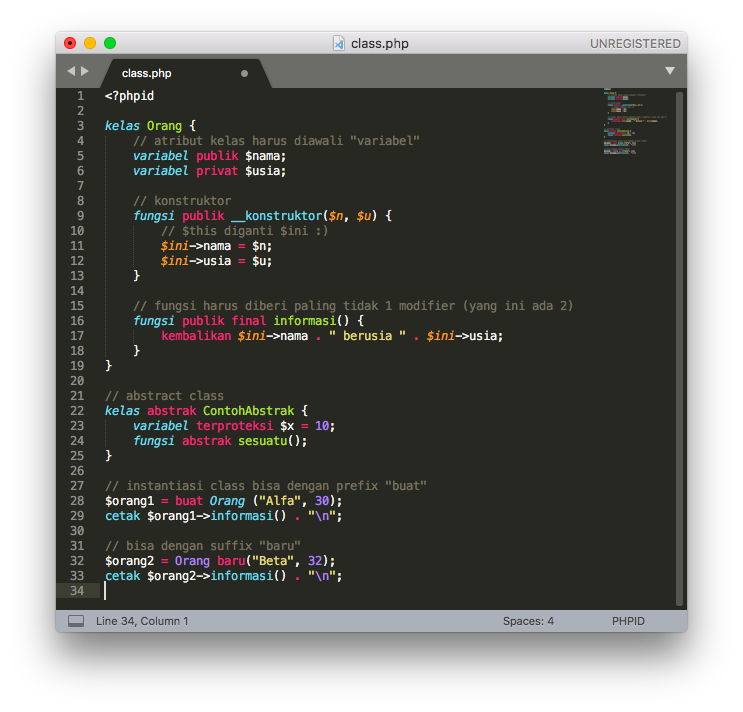

Package untuk Sublime Text 3
============================

Di folder ini terdapat folder "PHPID" yang merupakan package Sublime Text 3
untuk PHP Berbahasa Indonesia. Dengan menginstal package tersebut, Sublime Text 3 
akan memberi syntax highlight pada source code `.phpid`. Selain itu
terdapat juga fasilitas auto completion dan snippet.

## Instalasi

Salin folder "PHPID" ke folder "Packages" milik Sublime Text 3. Lokasi folder ini
berbeda-beda antar-platform (silakan cari di dokumentasi Sublime Text 3). Setelah itu akan tersedia menu pewarnaan sintaks baru ("PHPID") di menu View > Syntax.

