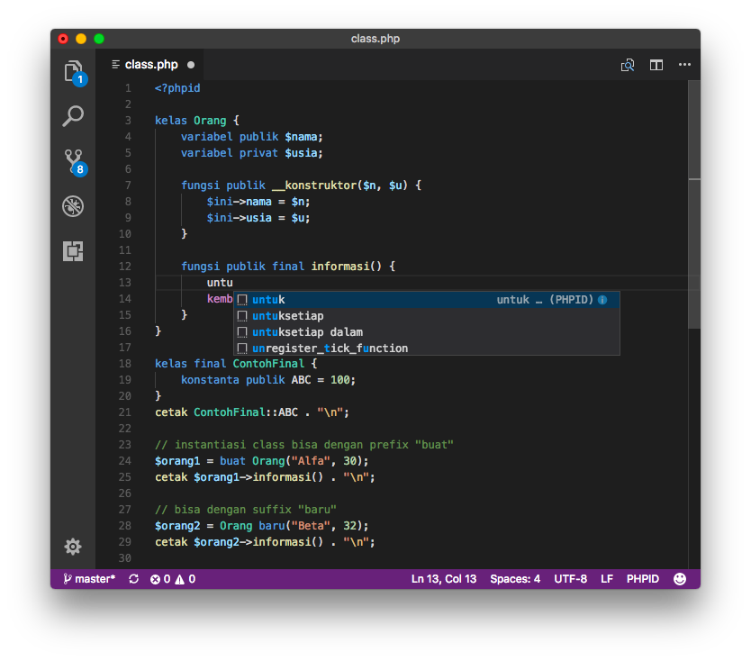

Package untuk Visual Studio Code
================================

Di folder ini terdapat folder "phpid" yang merupakan package Visual Studio Code
untuk PHP Berbahasa Indonesia. Dengan menginstal package tersebut, VS Code 
akan memberi syntax highlight pada source code `.php` maupun `.phpid`. Selain itu
terdapat juga fasilitas snippet yang bisa auto-complete.

## Instalasi

Salin folder "phpid" ke folder "extensions" milik VS Code. Lokasi folder ini
ada di `<HOME USER>/.vscode/extensions/` (biasanya hidden). Setelah itu akan tersedia menu pewarnaan sintaks baru ("PHPID") di selector bahasa di kanan bawah.
